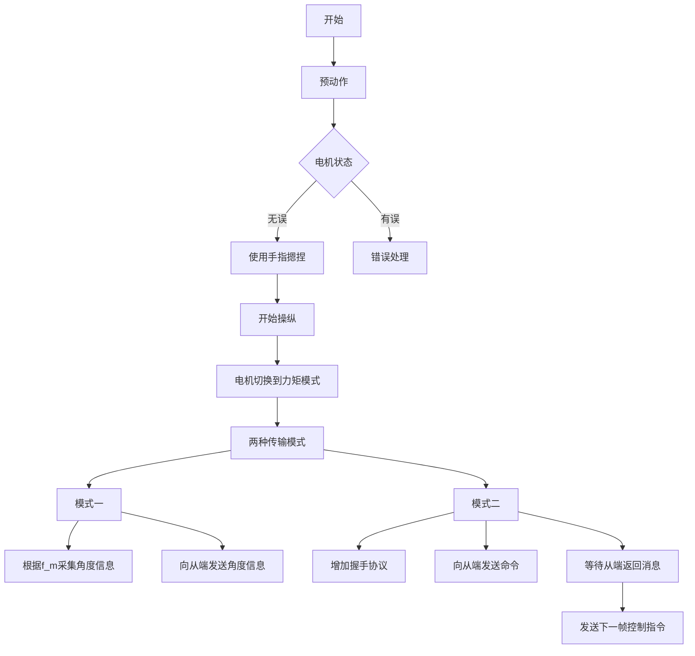

# STM32 IO表

编码器IO： PA0, PA1, PA4, PA5

..\..\Output\atk_f407.axf: Error: L6218E: Undefined symbol HAL_ADC_ConfigChannel (referred from adc.o).

预动作：

清除电机原有信息，上电

使用位置控制使各个关节回零到初始位置

读取电机状态；确定无误

使用手指摁捏表示操纵者准备开始操纵手术机器人

开始操纵：

电机切换到力矩模式，并保持力矩为零

两种传输模式：

根据设定的主端采样频率 f_m 采集角度信息，并向从端发送控制指令（两种模式）；

模式一：根据设定的发送频率$$f$$，向从端发送角度信息

模式二：增加”握手协议“，向从端发送命令，等待从端执行完毕后返回消息后再发送下一帧控制指令

为了避免主从不同步（操纵者的手比手术臂运动快）带来的信息丢失的问题，提出解决方案：

方案一：将命令缓存在一个数组中，
方案二：通过提供一个力反馈提醒操纵者？

用手捏pincher两次，作为开始控制的信号；当检测到gripper端编码器两次大幅度运动时（写检测和判断代码）

先实现DMA，然后写一下这个判断逻辑

* 成功实现DMA功能，现在将其移至到整体代码中-成功整合，遇到报错link 找不到函数的问题，因为没有添加对应=》成功整合代码；
* 

开始工作，进入while循环 

首先使用50Hz的频率采样读取电机角度，编码器角度

将读取的12个角度编码，通过CAN发送到从端单片机（这里写好了，但是需要整理）

