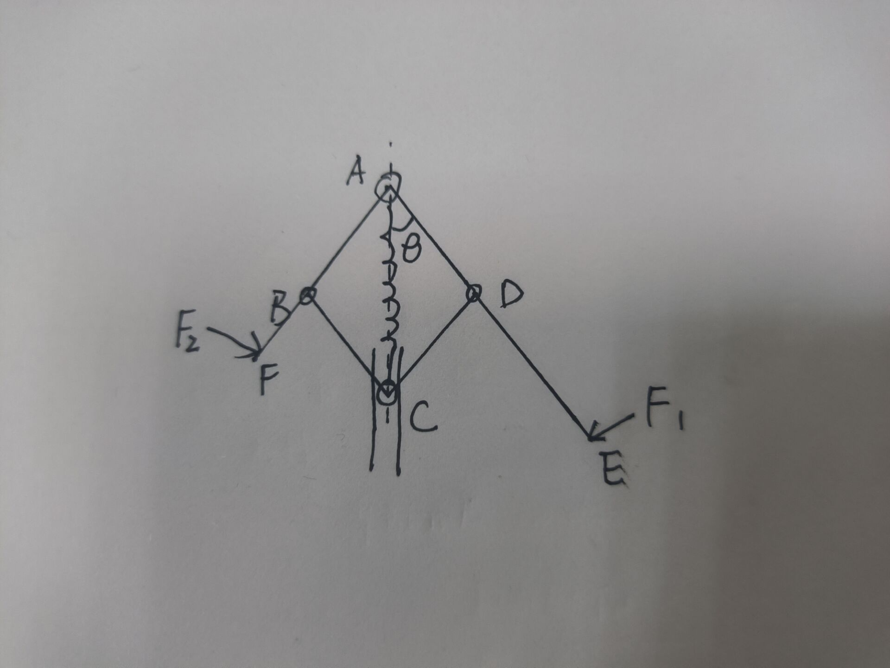
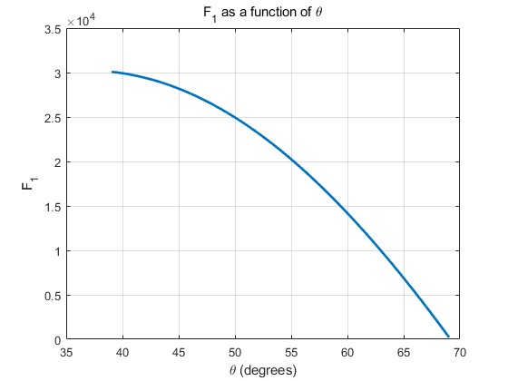

# grip_4_links_modle

## 手柄四连杆部分力学模型推导

目标：测量操纵者手指提供的压力，并将测量的压力映射到末端手术器械的压力。常规力传感器无法适配这里尺寸较小的结构，尝试通过检测角度，以及力学模型测量指端作用力；



主要任务：推倒四连杆力学模型，找到$F_1, F_2$ 与 $\ang DAC (\theta)$ 之间的关系；

1. 对连杆AE受力分析，根据关于A点力矩平衡，可以得到$F_1$ 与 连杆CD对连杆AE的支持力$F_{N1}$ 之间的关系：
   $$
   F_1 L_1 = F_{N1} l_0 sin(2\theta) \tag{1}
   $$
   同理可得到$F_2$ 与 连杆CD对连杆AE的支持力$F_{N1}$ 之间的关系：
   $$
   F_2 L_2 = F_{N2} l_0 sin(2\theta) \tag{2}
   $$

2. 对连杆CD受力分析，将力分解到x，y两个方向可以得到等式
   $$
   (F_{N1} + F_{N2} ) cos(\theta) = F_{sping} + f \tag{3}\\
   $$

   $$
   (F_{N1} - F_{N2} ) sin(\theta) = F_y \tag{4}
   $$

其中，$F_1, F_2, F_{N1}, F_{N2}, F_y$为未知量，$F_{sping}$ 为拉簧弹力，和$\theta$ 相关，可以通过检测角度获得；4个方程，5个未知数，

.因此有无穷解；对于我们感兴趣的$F_1, F_2$ ，我们只能得到两者之间的关系：
$$
(F_1 L_1 + F_2 L_2 )= 2(F_{spring} + f) l_0 sin(\theta)
$$
这个公式对应的物理含义就是：维持每个位置所需要的力矩；

绘制出$(F_1 L_1 + F_2 L_2 )$ 关于 $\theta$ 的图像




## 拉簧选型

通过计算，可以确定弹性系数大致在65左右，且原长为20，半径为3，线粗0.5 => 72.34

注意，线径为0.4时，k = 23.7 (也可以买过来试一下)

有一个问题在于，这是比较理想的条件下，如果引入摩擦力呢对于4连杆部分，摩擦力的主要来源轴承关节、轮子上下表面摩擦，目前感觉不是很大，暂不考虑后面再改进吧；压簧的摩擦力主要来源于平移块与轴之间的摩擦力，

```matlab
% 这个脚本用于计算pinch部分拉簧的弹性系数等参数
L1 = 13.8; 
L2 = 18.5;
l0 = sqrt(L1^2 + L2^2); 

% 弹簧参数确定
l_spring_total = 20;
D_spring = 3;
l_spring = l_spring_total - D_spring; 

% 力矩长度
l1 = 58;
l2 = 33;

theta_i = 120 - rad2deg(atan2(L2,L1));
theta_f = theta_i - 30;
F_max = 250 * (l1 + l2); %tau: g*mm
F_spring_max = F_max / (2 * l0 * sind(theta_f));
delta_x = 2*l0*cosd(theta_f) - l_spring;
k = F_spring_max / delta_x;
disp('拉簧弹性系数：');
disp(k);
```

附加之前扳机设计时的选型：

**扳机拉簧选型：**

| 参数 | 长度(L) | D     | d       | k(g/mm)   |
| ---- | ------- | ----- | ------- | --------- |
|      |         |       |         |           |
|      | 15      | 5     | 0.3     | 4.02      |
|      | 15      | 5     | 0.4     | 19.18     |
|      | **15**  | **5** | **0.5** | **60.01** |
|      | 15      | 4     | 0.5     | 91.11     |
|      | 15      | 3     | 0.5     | 194.44    |
|      | 10      | 3     | 0.4     | 127.45    |
|      | 10      | 3     | 0.5     | 437.5     |

* 手指拉力测试

  轻轻的摁压力大概为300g；稍微用力500g

  300 —— 500 比较合适

以及摁压过程的行程 $x$ = 4;
$$
k = \frac{F}{\Delta x} = 186.864
$$

手指扣拉簧选型

* 经过拉力测试，作用到最远距离所需的压力 F1, F2 (暂定400)分别为，根据推导模型，可以确定在最大型变量时最大的拉力


#### 第二代迭代

之前计算的拉簧弹性系数明显过大实际购买的弹性系数，通过矫正，新的弹性系数确定在32左右

暂定 3 * 0.4 * 20 => k = 28 


### 夹紧机构压簧选型

设计夹紧结构的目的是让操纵者在感觉上能感受到一个明显的变化，知道确定目前是“力控模式”，同时稍微增大拉力程度可以防止施力过大；为了防止把对象捏爆，是不是要加一个**反馈？？？**

需要满足的条件：

* 完全压缩需要小于等于2.5，2.5太小，拓展了一下到5.5
* 夹紧（释放）状态长度为7.5；此时理想的压力为3~5牛


弹簧选型时主要需要确定长度l、直径D、线径d；弹性系数与三者之间的关系是——，反比，正比

通过确定了两组压簧，外径5，线径0.5，长度10/15；

