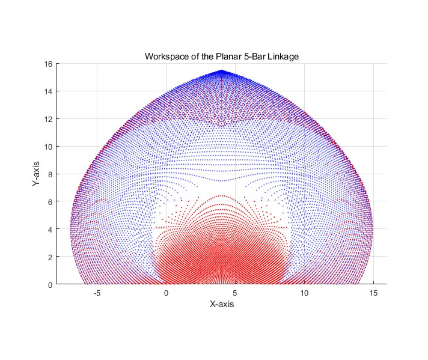

# Readme_planar 5 links 

提出第二代base结构，使用平面五连杆机构

## 平面五连杆结构的优势

## 运动学模型

$$
x_b = l_1 * cos(\lambda_1),
    y_b = l_1 * sin(\lambda_1); \\
    x_d = l_5 + l4 * cos(\lambda_4),
    y_d = l_4 * sin(\lambda_4); \\
    BD = \sqrt((xd - xb)^2 + (yd - yb)^2) \\
$$

$$
\phi_1 = cos^{-1}(\frac{l_2^2 + BD^2 - l_3^2}{2*l_2*BD}); \\
\phi_2 =  tan^{-1}(\frac{yd - yb}{xd - xb});  \\
\alpha_2 = \phi_1 + \phi_2
$$

具体的实现可以参照[代码](E:\GitHub\Mac_win\Mac_Win\sugical_robot\mechanical_model\plannar_5_links\planar_5_bar_foward_my.m)

为了满足规范的角度规定（如下图），得到新的公式结果：
$$
\alpha_2 =( \phi_1 + \phi_2 ) - \alpha_1  \\
\alpha_3 = \pi - ( \phi_3 - \phi_2) - \alpha_4
$$

根据论文里面的公式，可以求解末端端点，但是

https://journals.sagepub.com/doi/full/10.5772/45683

[目前发现最早动力学推导论文](https://www.sciencedirect.com/science/article/pii/S0957415804000625)：现在没心情看

[用在打印机上的平面五连杆](https://www.sciencedirect.com/science/article/pii/S0736584512001214)：机械结构设计可以参考

## matlab实践

https://ww2.mathworks.cn/help/sm/ug/five-bar-robot.html

https://blog.csdn.net/qq_36014310/article/details/76924980

## 工作空间分析

得到五连杆的正向运动学模型后，通过循环的方法似乎可以得到原始的工作空间

上面是不考虑对称位型的工作空间，下面红色是添加对称位型后的工作空间；其实也就多了中间一小部分，因此为了简化问题，这一部分确实可以舍弃，因此【需要考虑一些机械限位】

相比之下，通过缩短两个关节之间的距离，可以明显增大工作空间

## 结构设计

[日本轴承](https://detail.tmall.com/item.htm?spm=a21n57.1.item.2.5ae5523ccEkvGh&priceTId=215041aa17187626641891929e1a65&utparam=%7B%22aplus_abtest%22:%22dd09899006de88438ba666a726a98146%22%7D&id=668412789062&ns=1&abbucket=8&skuId=4809943724973)

[便宜一点的](https://detail.tmall.com/item.htm?spm=a21n57.1.item.48.5ae5523ccEkvGh&priceTId=2147bf3617187636843351715e1a6c&utparam=%7B%22aplus_abtest%22:%22d2c9aabf4e6b96251b2b7bc117ae65de%22%7D&id=611796709407&ns=1&abbucket=8&skuId=4777422306655)

目前计划选择  I5o14h5的 => 改为 I5O16H5，根部使用标准轴承 7000AC: 10 26 8

深沟轴承换为角接触轴承 需要 10 -15 个

轴承：

* [x] 推力轴承i6o19 x 6
* [ ] 

需要的螺栓：

* [x] M6 x 18 / 20 + 30
* [x] M4 x 26 + 20
* [x] m3 x 5
* [x] m2.5 x 10 \12
* [x] m2 x 20 + 8
* [x] m2 沉头 x 5
* [x] M6螺母
* [x] M4 螺母
* [x] phi6塞打螺栓x20
* [x] phi6塞打螺栓x25
* [x] phi6塞打螺栓x40
* [ ] 

 

