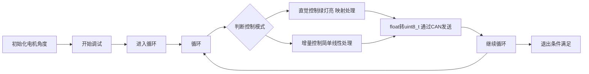

# Log-time

## Summer_log

目前的工作是新一版的主从控制实现，映射公式只差从常曲率关节空间到驱动空间了

硬件方面；角度都读取，也能够发送，下一步，将映射后的数据发过去，而不是电机驱动空间

* [x] 在c#中实现matlab已有的功能，将其整合到原来的project，有时间优化一下原来project，[参考](https://github.com/SJTU-RoboMaster-Team/Electronic-control-code-specification)
* [x] debug
* [x] 主从通讯调试
* [x] 两种模式==> 增量模式和绝对模式

### 主从映射公式推导

推导了【朝向和位置】满足【直觉映射】的公式，具体内容见

[mapping2.0](E:\GitHub\Mac_win\Mac_Win\sugical_robot\mapping_strategy\mapping_strategy2.0.md)

### 完善主从通讯

[嵌入式调试手册](E:\GitHub\Mac_win\Mac_Win\sugical_robot\EE_control\embedded_testing_log)

### 机械结构完善

[机械设计](E:\GitHub\Mac_win\Mac_Win\sugical_robot\mechanical_model\机械结构迭代log)

## Grade 2-up

上个学期大致完成了机械结构的搭建，同时在暑假完成了映射公式的推导，但是映射结果只用matlab进行了简单的数字验证，存在如下问题：

* 可能存在死区
* 结果不够直观

下一步计划是通过Qt搭建一个可视化界面，简易版是实时显示末端点（Position）+ 箭头(Orientation) 变换

[GUI传动什么](E:\Qt_Project\SR_Gui\SR_Gui.md)

### 震颤研究

因为老板不让学习Qt，因此GUI搭建计划被中断，只能之后晚上抽时间学一下了。

[tremor_research](E:\GitHub\Mac_win\Mac_Win\sugical_robot\tremor_research\tremor_in_surgical_robot.md)
