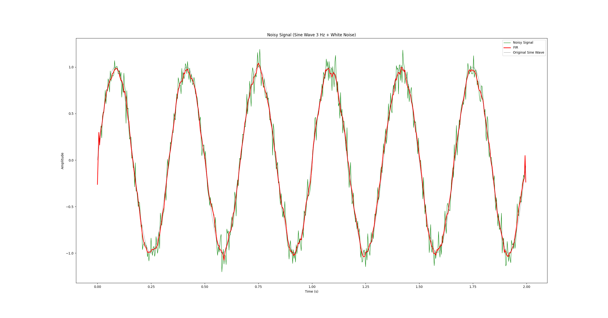

# Filters

为了提出更好的处理震颤的算法，需要对主流的滤波器更深刻的理解和掌握

[ELM](https://blog.csdn.net/qq_32892383/article/details/90760481)

## IIR / FIR

[讲得好](https://www.zhihu.com/question/323353814)

FIR 简单一点，所以先来讲一下FIR：

FIR的核心原理是，将附近几个点进行加权处理，得到更为接近平均值的数，最后连接起来就更为平滑，称为**滑动平均滤波方法**

 自己在python中实践了一下这个原理（纯用这个练一下收）

通过将相邻的几个数据取平均值；

而FIR利用的类似的原理，只不过是将之前的数据按照一定的加权求和，这一点和卷积非常的像

y[n]=a0x[n]+a1x[n−1]+a2x[n−2]+...y[n]=a_0x[n]+a_1x[n-1]+a_2x[n-2]+...

上式中的x代表待滤波数据，y代表输出数据；系数a0、a1、a2...就是滤波器的冲激响应系数。所以在FIR滤波器中，每一时刻的输出取决于之前的有限个输入，**因此就是“有限冲激响应”。**

FIR 滤波器之所以会产生延迟，主要原因在于其设计目标是实现**线性相位**。为了实现线性相位，FIR 滤波器通常设计为对称结构（即滤波器系数 *h*[*k*] 是对称的）。这种对称结构使得滤波器对不同频率的分量具有相同的相位延迟，而不会造成相位失真。

对于一个 *M* 阶的 FIR 滤波器，线性相位要求滤波器的中心点位于 *M*/2，

## SSA

### 1. SSA（Singular Spectrum Analysis）原理概述

**Singular Spectrum Analysis (SSA)** 是一种数据驱动的时序分析方法，通过**奇异值分解 (SVD)** 分解时间序列的结构，并将其分解成多个可解释的分量（例如趋势、季节性和噪声）。SSA 主要包括两个步骤：**分解（Decomposition）\**和\**重构（Reconstruction）**。

### 2. 分解步骤（Decomposition）

分解步骤将时间序列分解为多个分量，分为两个子步骤：**嵌入（Embedding）\**和\**奇异值分解（SVD）**。

#### 2.1 嵌入（Embedding）

在嵌入步骤中，将原始的一维时间序列 *x**N*=[*x*1,*x*2,…,*x**N*] 转换为一个多维的序列，构成一个**轨迹矩阵** *X**L*×*K*。

具体过程如下：

- **定义窗口长度 \*L\***：选择一个小于时间序列长度 *N* 的窗口长度 *L*，它的取值范围为 [2,*N*−1]。
- **构造延迟向量**：对于每一个时间点 *i*，构建一个长度为 *L* 的延迟向量 *x**i*=[*x**i*,*x**i*+1,…,*x**i*+*L*−1]*T*。
- **轨迹矩阵 \*X\***：通过将所有延迟向量按列排列，可以形成一个大小为 *L*×*K* 的轨迹矩阵 *X*=[*x*1,*x*2,…,*x**K*]，其中 *K*=*N*−*L*+1 是轨迹矩阵的列数。

#### 2.2 奇异值分解（SVD）

在嵌入完成后，SSA 算法在**轨迹矩阵的协方差矩阵** *S*=*X**X**T* 上进行奇异值分解（SVD）。通过 SVD，可以将轨迹矩阵分解成若干个**本征矩阵（elementary matrix）**的线性组合：

*X*=*X*1+*X*2+⋯+*X**L*

其中每个本征矩阵 *X**i* 是根据奇异值分解的结果得到的，即 *X**i*=*λ**i**u**i**v**i**T*，其中 *λ**i* 是第 *i* 个特征值，*u**i* 和 *v**i* 分别是对应的左右奇异向量。

### 3. 重构步骤（Reconstruction）

重构步骤将分解的各个本征矩阵组合，构建出我们希望的目标信号。重构分为两个子步骤：**本征三元组分组（Eigentriple Grouping）\**和\**对角平均（Diagonal Averaging）**。

#### 3.1 本征三元组分组（Eigentriple Grouping）

在本征矩阵中，不同特征值对应的矩阵代表不同的信号成分，例如趋势、周期性和噪声。我们可以根据不同特征值的大小分组，将一些代表信号的本征矩阵组合在一起，形成我们想要的目标信号的轨迹矩阵。

设 *I*=(*i*1,*i*2,…,*i**g*) 为所选特征值的集合，那么重构的轨迹矩阵为：

*X*^*I*=*j*=*i*1∑*i**g**X**j*

#### 3.2 对角平均（Diagonal Averaging）

对角平均用于将轨迹矩阵 *X*^*I* 转换回一维的时间序列。这个过程被称为 Hankelization，即通过对角线上的元素求平均来恢复时间序列。具体方法是：

- 沿着轨迹矩阵的反对角线（从左下到右上的方向）求平均。
- 对角平均的结果形成重构后的时间序列 *x*^*N*=[*x*^1,*x*^2,…,*x*^*N*]。

### 4. SSA的边界效应与零相位特性

在对角平均中，轨迹矩阵的边缘部分（例如 *x*^1 和 *x*^*N*）会因为反对角线上的元素较少而导致精度降低，称为**边界效应**。为了减少边界效应对最终信号的影响，SSA 通常会丢弃边界处的不准确数据。

- 
