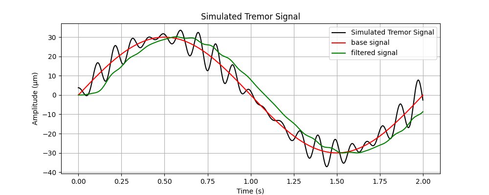

# Tremor_solve

* 为什么别人能够想到 类似于 SSA + EML的算法？可能文章看得还不够，同时也没有熟练的掌握信号处理相关技术。

  首先把之前看的文章总结一下，看一下别人是怎么做的，从中提取出一定的规律，并找到可以创新的点。

* 震颤处理的关键在于“对症下药”，目前的论文，似乎除了提到震颤的频率和振幅就很少分析了

  * 目前我的结论是，接近随机噪声，没有任何规律 =》应该用什么处理
  * 论文说有主频，有准周期性

* 似乎目前的算法都是集中处理一维的震颤，对于3维怎么处理是个值得研究的问题

* 到底是处理位置还是加速度？这个已经在一篇最早的论文里面找到了答案，无论是位置和还是速度，抑或加速度，都会出现一个8-12Hz的峰值，只是这个值在加速度中更明显，此外由于我的检测场景不一样，所以没必要完全追求论文的特征

* 滤波的局限性在于，只能消除单一模式的震颤

## 之前的人都用了哪些方法

目前看了有几篇生理震颤处理相关的论文了，感觉这方面的论文也不是很多，甚至可以完全总结出来，结合哈工大那篇硕士论文，可以来聊聊【生理震颤处理发展过程】

1987麻省理工P. O. Riley 和 M. J. Rosen采用低通滤波，滤除病理性震颤带来影响，结果表明低通滤波不仅精度不够高，而且还会带来明显的延迟，具体可以参照下面仿真的结果

零相位滤波通过引入逆向滤波器可以改善相位滞后的问题，但是因为引入了逆向滤波，就必须要进行时间序列反转，所以零相位滤波器无法应用 于实时系统

所以滤波主要需要完成两件事，**精准**+**实时**

查查看哪些滤波方法已经做到了这两点？

### FLC派

### 纯正FLC

基于LMS算法的傅里叶线性组合器（FLC）用于估计周期信号。FLC 算法的设计目的是估计和追踪具有周期性或准周期性的信号成分，它通过适应信号的频率特征来过滤掉不相关的噪声。

FLC在不知道参考信号时的滤波效果非常的差，这是由LMS的核心原理决定，这种算法更多是一个跟踪的算法，而不是滤波的算法（需要去看一下相关的文章，看看别人是怎么实现滤波的）；好好好跟踪技术也烂的一批

WFLC的效果更是烂的没法说，连跟踪效果都不如

**创新点**

* 虽然FLC的滤波效果很垃圾，但是它在跟随周期信号的能力却很强，如果能够把操纵信号和震颤信号分离开来，再对震颤信号进行预测和反向抑制，也算是消除震颤了
* 通过深入理解[LMS](https://zhuanlan.zhihu.com/p/358236441)的原理，或许可以有两种方法实现实时滤波
  * 之前说的，提取震颤信号，然后反向抑制
  * 以低通滤波作为参考信号

WFLC算法适用于震颤信号中存在的单一频率，但对于频谱域内两个或多个频率调制的震颤信号，WFLC算法的性能会下降。
在这种情况下，WFLC的频率自适应过程永远不会稳定，也永远无法得到准确的估计。
为了克服这个缺点，BMFLC可以跟踪输入信号中的多个频率分量。
BMFLC不像WFLC那样只有一个适应震颤基频的可变频率wo，而是预先定义了一个频带[w1 - wn]，然后将该频带划分为n个有限区间，区间之间间隔为Aw，如图2所示。
在第一个图中，我们可以看到n- flc被组合成BMFLC，该算法现在能够估计具有多个主导频率的信号。
在本文中，为了比较WFLC和BMFLC的效率，他们使用两个频率（??）的调制正弦信号来模拟震颤信号。
当信号中两个频率相等时，WFLC略优于BMFLC，但当频率间隙增大时，WFLC不能适应调制信号。
The BMFLC is not affected by the frequency gap. 
BMFLC不受频率间隙的影响。
When setting the value of △w to 0.1-0.5, estimation accuracy of 96-98% was obtained with the BMFLC.
当△w值为0.1 ~ 0.5时，BMFLC的估计精度为96 ~ 98%。

[github代码](https://github.com/Bjarten/flc-based-filters/blob/master/2.%20FLC.ipynb)

总的来说，FLC的核心是对周期性信号进行建模，从而进行一个快速的预测，因此对于准周期性的震颤，说不定有一定的预测能力，但是对于随机的信号，则完全没有用。

### 分解派

[这里总结了很多分解的算法](https://blog.csdn.net/weixin_44028734/article/details/139285218)

Sourav Chandra于2016年将EMD的方法应用于因疲劳引起的手部生理震颤，经验模态分解（Empirical Mode Decomposition，缩写EMD）是由黄锷（N. E. Huang）教授与其他人于1998年创造性地提出的一种新型自适应信号时频处理方法，特别适用于**非线性非平稳信**号的分析处理。该方法是依据数据自身的时间尺度特征来进行信号分解，无须预先设定任何基函数。作者认为震颤信号更突出的特征是非线性和非平稳的，传统的固定截止频率难以有效解决。因此采用了基于EMD的方法，EMD分解的一个重点是找到分界点，也即噪声和正常信号的分界点，然后进行重建，作者采用的是对称的Kullback–Liebler Divergence方法(SKLD)。

这个方法最大的问题，不能做到实时性，因为需要一串序列才能进行分解分析，也就是说，这是一个离线的算法，同时EMD计算复杂度也比较大。

Kabita Adhikari于2022年提出了一种可以应用于实时滤波的分解算法，通过SSA分解得到不含震颤信号的重建信号；这位仁兄通过迭代的方法，验证了分解应用在实时系统的可行性

目前看到这两篇

[具体原理参考这里](E:\GitHub\Mac_win\Mac_Win\sugical_robot\tremor_research\REF_TREMOR\Tremor_resolve\分解算法\分解算法研究.md)

#### 试一下事实移动滑动窗口EMD

相关文章：[online-EMD](https://ieeexplore.ieee.org/abstract/document/7952969)  [sliding-EMD1](https://link.springer.com/content/pdf/10.1140/epjnbp/s40366-014-0014-9.pdf) [2023年的EMD分解](https://www.sciencedirect.com/science/article/pii/S156849462300577X)  [sliding-EMD2](https://ieeexplore.ieee.org/abstract/document/5596536)

#### SVD才是分解算法唯一真神

https://ieeexplore.ieee.org/abstract/document/1254020（这篇论文中提到了很多子空间跟随的算法，似乎是一种实时SVD算法）

https://link.springer.com/content/pdf/10.1007/978-3-662-57380-8.pdf

https://www.sciencedirect.com/science/article/pii/S1746809421009058#ab005

* 目前的想法是通过设置双窗口的长度，构造**满秩**（如果信号出现较强的相关性，这个似乎不能满足）的方阵，从而避免奇异值分解，而是通过特征值分解
* 在python中实现一下传统SSA+滑动窗口的实际情况：当窗口比较小的时候，除噪效果还可，就是还是会有比较明显的抖动，也就是说，震颤有被削弱，但是不如离线的SSA效果那么好；
  * 调试了几个参数，首先相比于高频的白噪声，生理震颤产生的噪声的能量频率要小的多得多，基本上主频和噪声成分相差了2个数量级，因此最终滤波效果就是取最主频成分的时候，通常第二个奇异值代表大幅度的震颤，而更小的奇异值代表小幅度高频震颤；相比之下白噪声的
  * 对于特征值分解和奇异值分解，当轨迹矩阵为方阵的时候，特征值的绝对值就等于奇异值；而且主要是，反正也只能取k=1，结果都一样
  * 对于实时算法，即使k=1，也就是提取最主频的成分了，最后滤波的效果还是非常烂，尤其是对震动幅度较大的情况；
  * 实时SSA最大的一个问题是很大的问题是，当噪声（抖动）的横向幅度很大，窗口很短的时候，这个时候窗口很可能把噪声识别成主频成分，这个就很难搞了；通过拉长窗口可也解决这个问题，但是计算量会指数上升；怎么保证窗口小的同时，能够识别全局（只能通过一些之前的东西，来影响现在，类似于卡尔曼滤波，或者遗忘因子的）；论文中通过迭代协方差矩阵的方法确实看着比较合理，但是协方差矩阵是如何重构得到重构矩阵的，我觉得没有说清楚
  * 
  * 有没有可能，滑动m次后，取m个观测的值
  
* 

### KF为代表的预测模型

很惊奇的是，竟然没有多少关于实时滤波的研究？就是像KF滤波一样是一个实时迭代滤波算法

* 扩展卡尔曼滤波
* 

### 最后杀招ML

[知乎总结的实时降噪算法](https://zhuanlan.zhihu.com/p/431275459)

## 对生理震颤信号进行了哪些分析

* 通过频谱分析，发现震颤频谱中存在多个主频成分，不同个体在震颤频率和幅度上存在差异。

* **主频成分**：生理震颤信号中包含一个或多个明显的主频成分。这些主频成分往往集中在 8-12 Hz 的范围内，但在具体表现上可能存在多个较小的峰值，这说明震颤信号中包含多个频率成分。 // 为什么，我的数据就是得不到这个主频成分？我对震颤更像是一个随机信号

  原来是要计算加速度的量，加速度的成分确实是8-12hz

* **非稳定性**：生理震颤的频率成分并不是完全固定的，它会在一定范围内随着时间波动，这被称为非平稳特性。就我的结果来说

* **准周期性**：虽然生理震颤的相位不完全稳定，但其波形在一段时间内可以表现为准周期性，这意味着相邻周期之间的波形相似度较高。这个准周期性特征可以用来识别震颤信号与其他类型的运动或噪声的区别

* 幅度变换：幅度不是恒定的，它会随着时间和活动类型而变化。研究表明，随着肌肉的疲劳、压力增加，或随着活动频率的增加，震颤的幅度可能会有所增加。

* **随机相位特性**：由于生理震颤包含多个频率成分，并受到体内神经肌肉反馈系统的影响，其相位特性通常表现为随机性。多个频率成分的相位关系并不固定，导致震颤信号的波形在时间上呈现出随机波动。

* 随着肌肉的疲劳、压力增加，或随着活动频率的增加，震颤的幅度可能会有所增加。

以上均来自estimation of physiological tremor.....

* 采取数据时还真的把手肘放到台子上了，但是放在台子上确实还是有生理震颤，不过是空手的情况，实际捏住操纵台频率会有影响，有两点原因：

  * 第一是整个操纵台有一定的阻尼
  * 我这个结构一定程度上限制了手指的运功

  因此，如果真的要获取手部震颤还需要借助其它精度更高的方法

因为自己进行频谱分析后完全得不到相同的数据，考证一下论文中数据的可靠性；目前自己的数据完全没有所谓的主频成分，论文是怎么得到这个8-12Hz也是非常的含糊不清，这篇论文终于把震颤频率说清楚了，md，很多论文其实是错的

## 多维震颤处理

目前论文大多只关注一个自由度的震颤情况，实际震颤滤除肯定是要3维甚至6维处理。常规的思路是对xyz三维数据分别滤波处理后联合起来。
我目前有一个想法是，不对3维处理，而是对垂直运动方向的法线方向进行数据处理，这样比较符合物理实际震颤规则。因为，当手部运动起来时，震颤对运动方向的影响是可以忽略不记的，但是垂直运动方向的震颤还是会很明显，从图中可以看出。

目前的主要问题是，如何去描述这个法线方向上的震颤；

* 局部线性化？就是选择合适的窗口大小，然后进行滤波？不知道效果会不会好一点
* 描述点在切线方向上的偏移量？如何描述偏移量，这个是个问题，目前尝试的方法效果十分不好
* 直接对一阶微分进行滤波？

### 局部线性化

这个更是不行了，滤波的基本原理，本来就是将原本信号和噪声信号区分出来，两个相差越大越便于分离，局部线性化反而把这种差值变小了。

### 直接处理切线分量呢

通过求单位向量？最终把滤波对象变为角度变换，实际上就是对多维

### 一阶微分滤波

目标：对比对原信号滤波和一阶信号滤波哪个更好（一阶信号中噪声的特征是噪声变换很大）

滤波的本质是对突变信号的抑制？对应到一阶微分，那就是减小一阶微分的绝对值？ 
出现噪声的地方一阶信号通常幅值较大，二阶微分就更离谱了

先只考虑一阶微分，一阶信号出现更为剧烈的震颤（震颤特征更明显），那么先对一阶信号滤波处理，然后再将处理结果反推回去？可以试试

* 对比一阶滤波和原信号在一维上滤波离线算法的效果（**原信号滤波胜利**）

  先尝试一下离线算法中的零相位滤波和中值滤波得到滤波后的一阶插值，然后通过积分的方法，得到新的信号，对比直接使用零相位滤波的结果
  

* 但是离线算法没有太大意义，还是来看看实时算法

  两个似乎都不咋样

  

* 对比在二维甚至三维的离线滤波算法

  直接对一阶信号滤波输了呜呜呜

一阶微分操作倾向于放大高频噪声，而这些高频成分往往在信号中是不必要的。当你之后对这个经过微分的信号进行滤波时，滤波器可能未能有效去除这些高频噪声，这会导致它们在积分回信号时产生更加显著的累积错误。因此，经过微分的信号可能会引入更多的不稳定性。

虽然直接对一阶信号处理不太可行，但是一阶信号的噪声频率更为明显，可以用来作为判断噪声的主要依据。一次一个任务是**“从一阶信号中找到噪声”**

## 如何获取高精度震颤

## 论文中的方法

我现在就是像知道8-12Hz的震颤是不是位移，还是加速度量？然后他们是对位移进行滤波还是加速度进行滤波

| 论文                                                       | 传感器   | 参数   | 备注                                                         |
| ---------------------------------------------------------- | -------- | ------ | ------------------------------------------------------------ |
| SVM-ML-2014                                                | M2S2     | 位移   | 文章刚开始使用光学仪器直接获取单自由度的位置信息，并使用带通滤波提取震颤信号，并将其作为离线数据集；后续实验验证时，获取震颤信号是这个，但是实际算法中，位置是靠加速度计二重积分获得 总之算法就是对位置信号处理的 |
| PHYSIOLOGICAL TREMOR                                       | 加速度计 | 加速度 | 最早的用仪器研究加速度的文章，也是提出震颤频率为10hz的论文，显然作者说的10hz就是加速度的频率 |
| 8- to 12-Hz Component of Human Physiological Finger Tremor | 力传感器 | 力     |                                                              |
| BFLC                                                       | M2S2     | 位移   | 对于                                                         |

SVM这篇论文使用的M2S2

## 我的数据

* 静态数据

  也就是通过视觉让末端保持一个点，会得到一组 $p = [x,y,z] ^ T$ 的数据，为了观察震颤：

  * 首先写一个函数，把x,y,z 三个方向的图像绘制出来
  * 
